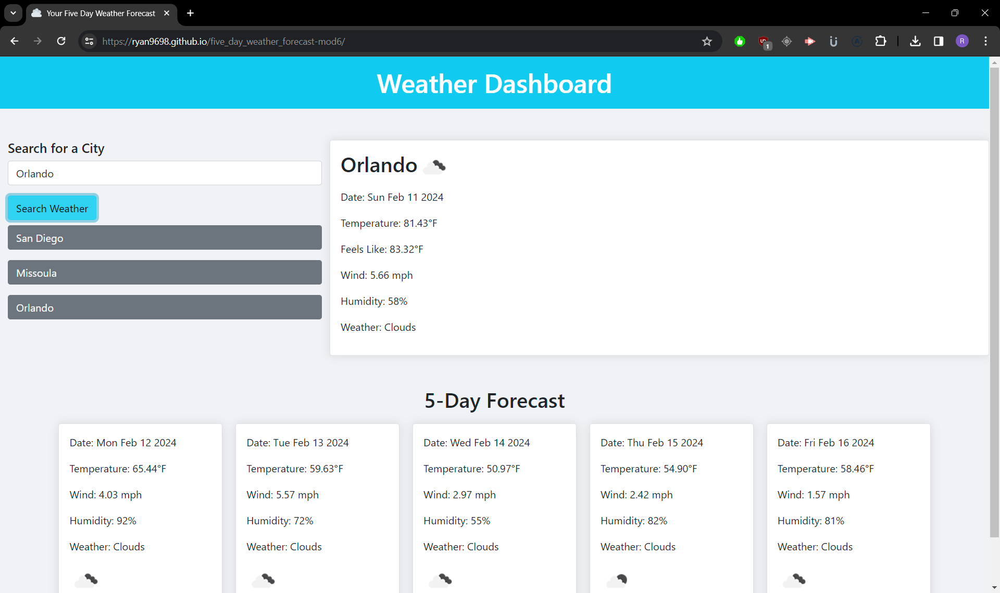

# Five Day Weather Forecast - Module 6 Challenge

## Table of Contents

1. [Description](#description)
2. [Installation](#installation)
3. [Usage](#usage)
4. [Contributors](#contributors)
5. [License](#license)
6. [Link](#link)
7. [Screenshot](#screenshot)
8. [Questions](#questions)

## Description

This web app is designed to notify the user of current weather conditions in the city of their choice. It's meant to be an easily accessible app for determining the upcoming weather. Working through this app, I learned a lot about basic API calls and the data that is returned and how to modify that data to render on a webpage. I learned more about how to style dynamic elements such as the containers when they're replaced after the API calls the data. This app also helped me to better understand how to utilize the Dev Tools to collect the data I need from APIs to suit the purpose of my application. I decided to add a couple of other features such as the automatic conversion of Kelvin (API return) to Fahrenheit and displaying "Feels like" to make it more in line with more authentic weather applications. Icons are displayed based on weather conditions so you can quickly tell what kind of weather is in the area at a glance.

## Installation

N/A

## Usage

Using the project is easy, type in the city you wish to see the current weather for and click the "Search Weather" button. The app will display the current weather as well as a 5 day weather forecast for the city of your choice. A button with the city will generate allowing you to quickly call the data back. The information is saved to local storage. Searches are configured for US cities.

## Contributors

This app uses APIs from https://openweathermap.org/api

Favicon sourced from Twitter Twemoji:

- Graphics Title: 2601.svg
- Graphics Author: Copyright 2020 Twitter, Inc and other contributors (https://github.com/twitter/twemoji)
- Graphics Source: https://github.com/twitter/twemoji/blob/master/assets/svg/2601.svg
- Graphics License: CC-BY 4.0 (https://creativecommons.org/licenses/by/4.0/)

## License

No license for this app.

## Link

[GitHub_Pages]()

## Screenshot

## Questions

If you have any questions or would like to see my work, you can see my GitHub portfolio: [Ryan9698](https://github.com/Ryan9698).

or reach me by email: [rcaltabiano90@gmail.com](mailto:rcaltabiano90@gmail.com).
